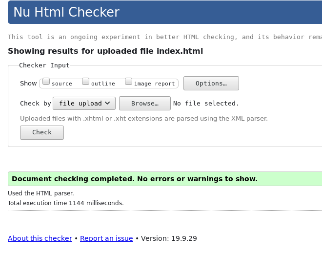
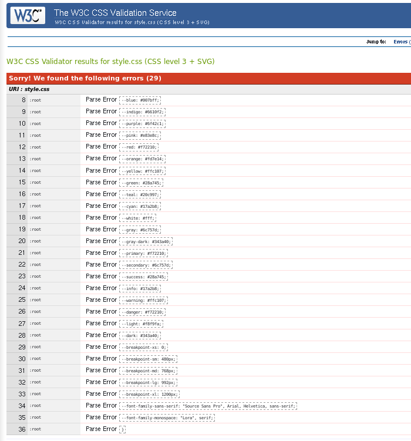

# Using-Bootstrap
This project requests students to build a replica of the news site Newsweek.com using the Bootstrap framework.

# Preview

# Validations

> It cames from validator's fault identifying css variables, not from code

# Features

* Reconstructed Bootstrap on SASS. Used SASS version of bootstrap to make the site.
* Original images of site.
* Bootstrap's grid

# Built With

* Flexbox CSS
* Love and Passion for code.
* HTML5 with help of SASS Compiler.

> note: Due to `stickler`, I striped down all SASS files. You can check on them on the branch.

# Author

* [Israel Laguan](https://github.com/Israel-Laguan)

# License

This project is licensed under the MIT License - see the [LICENSE.md](LICENSE.md) file for details